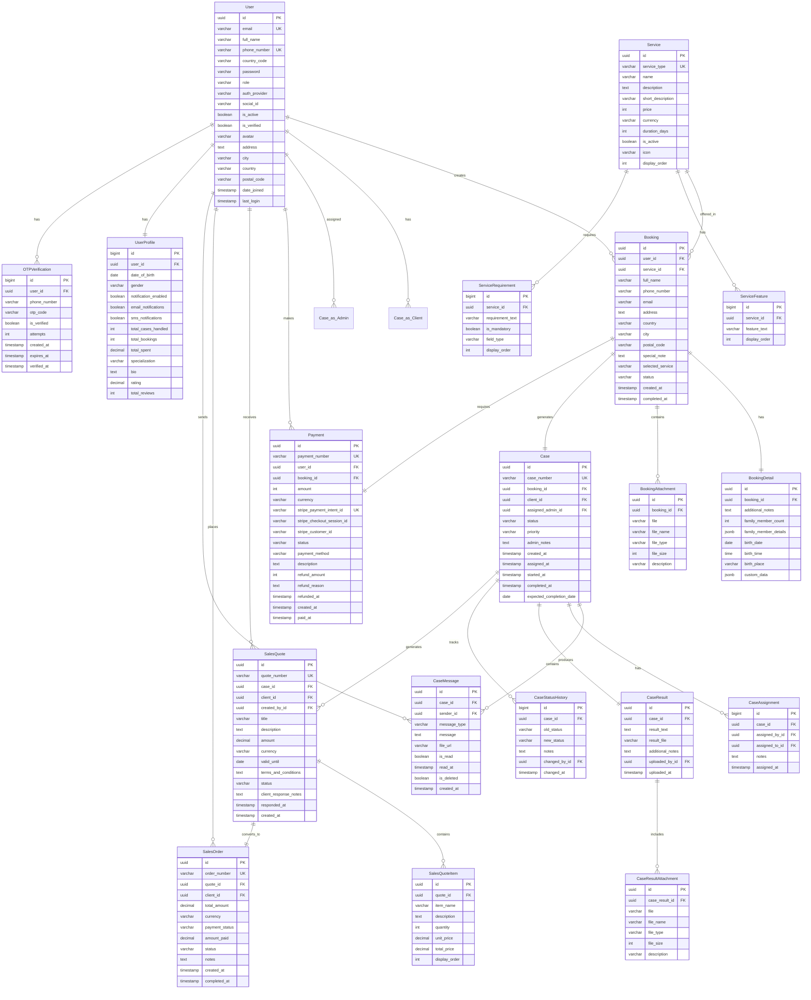
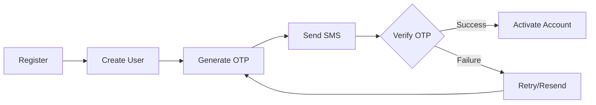
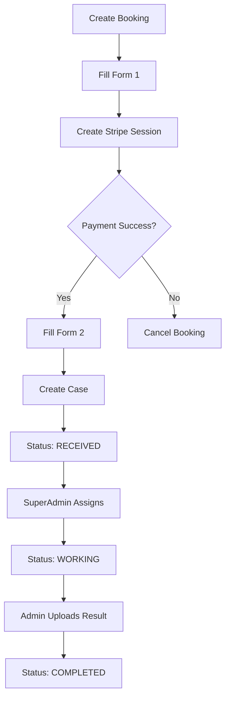
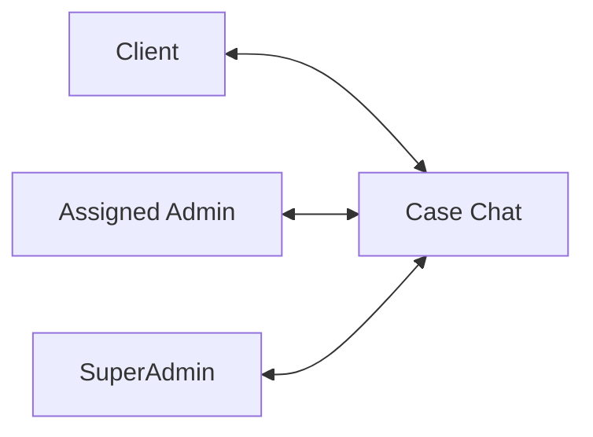
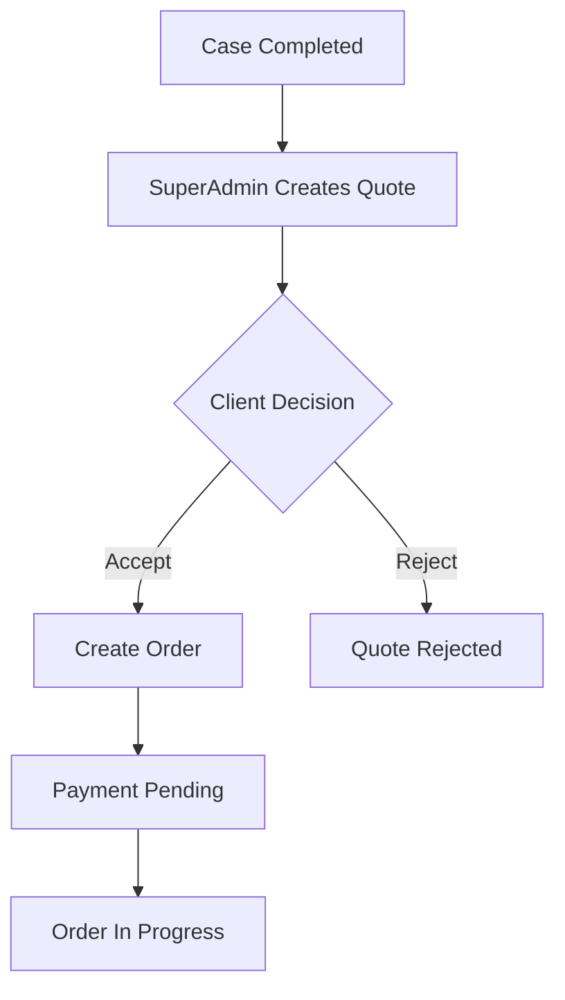

# Database Schema Diagram



## Entity Relationships Summary

### User-Centric Relationships
- **User → Booking**: One-to-Many (A user can create multiple bookings)
- **User → Case (Client)**: One-to-Many (A client can have multiple cases)
- **User → Case (Admin)**: One-to-Many (An admin can be assigned multiple cases)
- **User → Payment**: One-to-Many (A user can make multiple payments)
- **User → UserProfile**: One-to-One (Each user has exactly one profile)

### Service Flow
- **Service → Booking**: One-to-Many (A service can be booked multiple times)
- **Service → ServiceFeature**: One-to-Many (A service has multiple features)
- **Service → ServiceRequirement**: One-to-Many (A service has specific requirements)

### Booking to Case Pipeline
```
Booking → Payment (1:1) → Case Creation (1:1)
```

### Case Management
- **Case → CaseMessage**: One-to-Many (Multiple messages per case)
- **Case → CaseAssignment**: One-to-Many (Track all assignment history)
- **Case → CaseResult**: One-to-One (One result per case)
- **Case → CaseStatusHistory**: One-to-Many (Audit trail)
- **Case → SalesQuote**: One-to-Many (Multiple quotes can be generated)

### Sales Flow
```
Case → SalesQuote → SalesOrder (upon acceptance)
```

### Quote Structure
- **SalesQuote → SalesQuoteItem**: One-to-Many (Line items in quote)
- **SalesQuote → SalesOrder**: One-to-One (Quote converts to order)

## Key Database Indexes

### Performance-Critical Indexes
```sql
-- User lookups
CREATE INDEX idx_users_email ON users(email);
CREATE INDEX idx_users_phone ON users(phone_number);
CREATE INDEX idx_users_role ON users(role);

-- Case management
CREATE INDEX idx_cases_number ON cases(case_number);
CREATE INDEX idx_cases_client_status ON cases(client_id, status);
CREATE INDEX idx_cases_admin_status ON cases(assigned_admin_id, status);
CREATE INDEX idx_cases_status_created ON cases(status, created_at);

-- Payments
CREATE INDEX idx_payments_user_status ON payments(user_id, status);
CREATE INDEX idx_payments_stripe ON payments(stripe_payment_intent_id);
CREATE INDEX idx_payments_created ON payments(created_at);

-- Messages
CREATE INDEX idx_messages_case_created ON case_messages(case_id, created_at);
CREATE INDEX idx_messages_sender_read ON case_messages(sender_id, is_read);

-- Bookings
CREATE INDEX idx_bookings_user_status ON bookings(user_id, status);
CREATE INDEX idx_bookings_created ON bookings(created_at);

-- OTP
CREATE INDEX idx_otp_phone_verified ON otp_verifications(phone_number, is_verified);
CREATE INDEX idx_otp_created ON otp_verifications(created_at);
```

## Data Flow Diagrams

### User Registration Flow


### Booking to Case Flow


### Chat Participants Flow


### Quote to Order Flow


## Table Size Estimates (1 Year)

Assuming:
- 1,000 clients
- 5,000 bookings/year
- Average 15 messages per case

| Table | Estimated Rows | Storage Est. |
|-------|----------------|--------------|
| users | 1,100 | 1 MB |
| bookings | 5,000 | 5 MB |
| cases | 5,000 | 10 MB |
| case_messages | 75,000 | 50 MB |
| payments | 5,000 | 5 MB |
| sales_quotes | 2,000 | 3 MB |
| sales_orders | 1,500 | 2 MB |
| **Total** | **~94,600** | **~80 MB** |

*Note: File storage (media files) not included - depends on upload volume*

## Backup Strategy

### Daily Backups
```bash
# Full database dump
pg_dump -h localhost -U aoqolt_user aoqolt_db > backup_$(date +%Y%m%d).sql

# Compress
gzip backup_$(date +%Y%m%d).sql

# Upload to S3
aws s3 cp backup_$(date +%Y%m%d).sql.gz s3://aoqolt-backups/
```

### Point-in-Time Recovery
- Enable WAL archiving in PostgreSQL
- Store WAL files in S3
- Allows restore to any point in time

### Media Files Backup
- S3 versioning enabled
- Cross-region replication for disaster recovery
